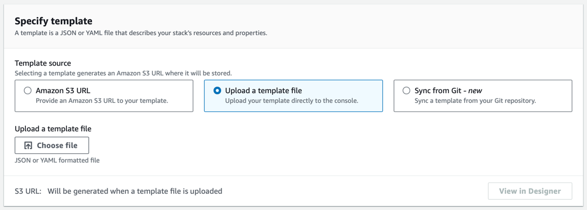

Symfony Demo Docker
========================


The "Symfony Demo Application" is a reference application created to show how
to develop applications following the [Symfony Best Practices][1].

You can also learn about these practices in [the official Symfony Book][2].

Requirements
------------

* Docker

Usage
-----

There's no need to configure anything before running the application. To build the images and start the containers, run:

```bash
docker compose up -d
```

Then access the application in your browser at http://localhost:8000.
And PHPMyAdmin interface at http://localhost:8080.

Deployment to ECS Fargate
-------------------------

The stack can be deployed to ECS Fargate using the provided [`cloudformation.yaml`](./cloudformation.yaml) template.

### Requirements

The template expects the following resources to be present before the deployment:

- VPC
- Private subnet + NAT Gateway (To allow outbound access to the internet)
- Public subnet + Internet Gateway (Allow inbound and outbound access to the internet)
- The web app docker image to be stored in a registry (ECR or public docker)

### Deployment

The template **only deploys the app and the db**, phpmyadmin is purposely left out.

#### Option 1: One click deployment

[](https://console.aws.amazon.com/cloudformation/home#/stacks/quickcreate?templateURL=https://cf-templates-1d9pwggnxtxer-us-east-1.s3.amazonaws.com/2024-02-19T210457.796Z51l-cloudformation.yaml&stackName=ECS-Symfony&param_DBImage=docker.io/mysql)

#### Option 2: Manual deployment

1. Download the [`cloudformation.yaml`](./cloudformation.yaml) file
2. Go to [Create Stack](https://console.aws.amazon.com/cloudformation/home#/stacks/create) in the AWS Console
3. Under Specify Template Select "Upload a template file"
    
4. Click on Choose file and upload the cloudformation.yaml file downloaded in step 1 and click **Next**.
5. Fill in all The fields and click on **Next**
6. Leave everything as the default and click on **Next** and **Submit**.

[1]: https://symfony.com/doc/current/best_practices.html
[2]: https://symfony.com/book
